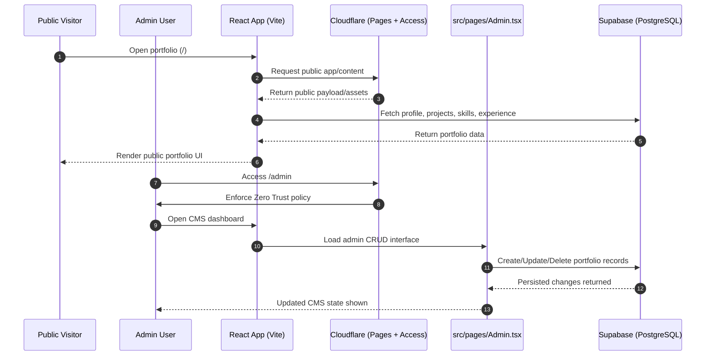

# Portfolio Forge

Portfolio Forge is a highly dynamic, full-stack developer portfolio with a secure, built-in CMS for managing profile, projects, skills, and experience data.

## Context (For AI understanding)

This repository is organized around two primary data paths:

- **Public portfolio path:** The main portfolio experience renders public content for visitors.
- **Admin CRUD path (Supabase-backed):** The CMS dashboard updates portfolio records via Supabase-backed create, read, update, and delete flows.

The `/admin` route is protected by **Cloudflare Access (Zero Trust)**. Because access control is enforced at the edge, the frontend does not need complex client-side authentication logic for this path.

Portfolio UI modules inside `src/components/portfolio/` are **presentation components only**. They should be treated as display-focused components that receive data through props.

## Tech Stack

- React 18
- Vite
- TypeScript
- Tailwind CSS
- shadcn/ui
- Supabase (PostgreSQL)
- Cloudflare Pages
- Cloudflare R2 (assets)
- Cloudflare Zero Trust

## Flow, Sequence, and Architecture Diagrams

### Architecture

```mermaid
flowchart TD
    U[Visitor / Admin Browser] --> FE[React SPA\n(Vite + Router + Query)]

    FE -->|GET /api/content| CFPublic[Cloudflare Function\nfunctions/api/content.ts]
    CFPublic --> KV[(Cloudflare KV\nCONTENT_KV)]

    FE -->|GET/PUT /api/admin/content\nPOST /api/admin/upload| CFAdmin[Cloudflare Admin Functions\nAccess-protected]
    CFAdmin --> KV
    CFAdmin --> R2[(Cloudflare R2\nASSETS_BUCKET)]

    FE -->|Direct CRUD (projects/skills/experience/profile)| SB[(Supabase)]
```

### Sequence Diagram



## Where to Find What (Repository Guide)

- **Main Public UI Wrapper:** `src/pages/Index.tsx`
- **Admin Dashboard (CMS):** `src/pages/Admin.tsx`
- **Visual Components (Do not break styling here):** `src/components/portfolio/` (Hero, Projects, TechStack, Experience, etc.)
- **Database Connection:** `src/integrations/supabase/client.ts`
- **Cloudflare API/Functions:** `functions/api/`
